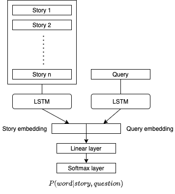
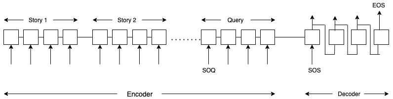
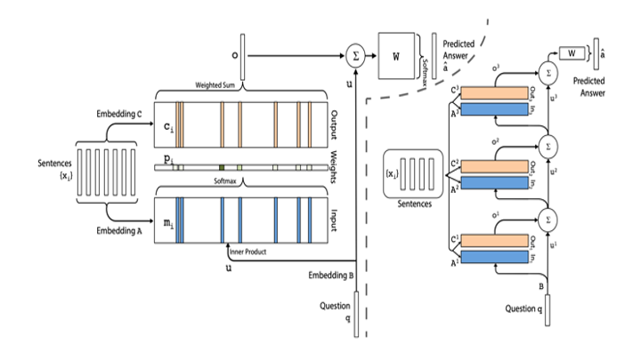
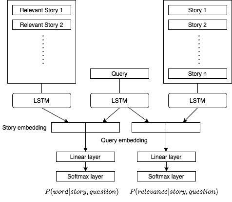
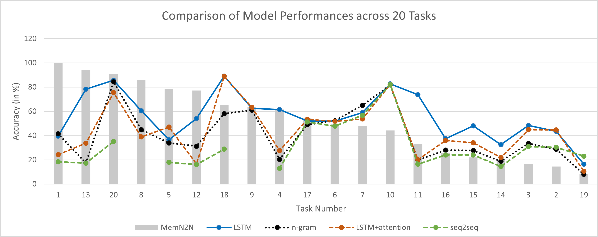

## Introduction

Question answering is one of the most challenging applications we have in Natural Language Processing. It is widely used in applications like information retrieval and entity extraction. It is also used as the back-end framework for systems like chatbots and for simulating human-like conversations. While it is ambitious to create and evaluate the performance of an agent in general dialogue, it is relatively easier to evaluate its responses to input questions. This enables us to test different capabilities of learning algorithms, under a common framework. Using QA frameworks, we aim to create a framework capable of open-domain question answering i.e. answering arbitrary questions with respect to arbitrary documents.

Question answering systems enable users to retrieve exact answers for questions posed in natural language. They automatically answer questions asked by humans in natural language by referring to either a pre-structured database or a collection of documents/text-pieces written in a natural language. 

Question answering (QA) is a complex natural language processing (NLP) task. It requires an understanding of the meaning of a text piece (story) along with the ability to reason over relevant facts contained within the leading stories. It then employs a model that can answer questions based on logic, reasoning and even understanding of natural language.

## Data

For building all the models in this report, we use the data from the Facebook bAbI project \cite{babi}. bAbI is a carefully-designed set of 20 QA tasks. Each of these tasks consist of several context-question-answer triplets, prepared and released by Facebook. Each task tests a different skill that a question answering model should have. The bAbI dataset comprises of synthetically generated stories about activity in a simulated world. This makes the vocabulary of this dataset very limited. Moreover, the sentence forms are very constrained. These limitations make this dataset an ideal dataset for rapid experiments and developing models. However, they raise questions about the ability to generalize results on bAbI to Question Answering scenarios in a less stringent/defined environment. 

The models are built with the intention that they perform well on the test data. For this purpose, we have split the given QA sets into train and test dataset. Even if a model shows a good performance here, it is not sufficient to conclude that the model would also exhibit this ability on real world text data. 

## Model architectures

In this project, we are building models to develop the Question Answering framework.1We arebuilding and evaluating several models for this purpose:  (i) N-gram classifier (ii) LSTM (LongShort-term Memory) (iii) End-to-end Memory networks (iv) Seq2Seq (sequence-to-sequence)model (v) LSTM + attention

### N-Gram Classifier

An N-gram model constructs a sequence of N words that occur in a sequential combination in thegiven text. We used a N-gram model to define the baseline. This model was inspired by the workdone by Richardson et al. We trained the N-gram model using both unigrams (1-gram) and bigrams (2-gram) individuallyto produce answers for the different tasks.  For this, we selected only those sentences that had atleast one common word with the story.  We then constructed a bag-of-unigrams and a bigramsrespectively from the stories. This was then fed into a Linear Support Vector Classification (SVC) model. We constructed two separate models using unigrams and bigrams respectively and selectedthe better-performing model.The linear classifier was used to predict the answers using the features extracted from the vocabularyof the stories. Since the model uses only the vocabulary as the features, it is predicted to performsub-optimally in tasks that rely on reasoning beyond language.

### LSTM

To capture the semantic structure of the stories and the question, we experimented with LSTM based sentence embedding. LSTM is a type of recurrent neural networks, that process the input word by word and update hidden state to capture the structure of the sequence of words in the sentence. The figure below shows the architecture of LSTM network.

  

### Seq-2-seq

To improve the performance of our models, we implemented a sequence-to-sequence model. The benefit of this framework over the other models is that it does not treat the answers as single-words and can thus incorporate comma-separated lists as answers, especially for tasks 8 (Lists/Sets) and 19 (Path Finding). 
Figure below illustrates how a sequence-to-sequence network can be trained on a question answering task. The basic architecture of a seq-2-seq includes an RNN encoder (LSTM cell) that processes the stories (all concatenated together), followed by a special question-start symbol (SOQ), and then the question. The special SOS symbol tells the network to start decoding, with the decoder’s initial state being the final state of the encoder. The decoder produces an answer sequence, followed by the special stop symbol EOS that indicates that processing must end. The network is trained using cross-entropy error on the decoder output, as compared with the correct answer sequence.

During training, the decoder also receives the correct answer as input following the SOS symbol. During validation and testing, the correct answer is not provided: we only provide the SOS symbol. At subsequent steps, the output of time step (t) is fed to the decoder as the input at time step (t + 1). The model architecture is shown in figure below.

### End-to-end Memory Network

An end-to-end memory network, as shown in figure below, is a kind of memory network \cite{MemNetworks} which uses simpler input feature maps and memory generalization steps than those used for dynamic memory networks \cite{dmn}. The simplification allowed for faster training and a greater range of experimentation within the scope of a course project. Furthermore, end-to-end networks have shown state-of-the art performance for weak supervision on the bAbI dataset. As we are interested in examining the greater generalizability of the weak supervision use case, end-to-end memory networks present a good choice for the main architecture for the project.

### LSTM + attention

The LSTM model suffers in some tasks as the length of stories increases as facts mentioned earlier in the story suffer from diminishing gradient problem. The bAbI dataset has information about the specific stories required to answer the question. In this model we used this supporting information to pay attention to stories that are relevant. To achieve this we extended the LSTM model with attention mechanism. 

This model targets to learn two objectives. It tries to learn which story is relevant given the question, and given relevant stories it tries to learn to get closer to the answer. During training only the relevant
sentences are fed as input into the previously described LSTM sentence embedding model. The mechanism is trained using the relevant sentence supervision signal provided with each example. For every story $s$, the model predicts the probability that the story is relevant in the example. During inference, any story with relevance probability greater than 0.5 was used to predict the answer. If no story had probability greater than 0.5 then the top two stories with highest probabilities were used. 
We used a joint loss function and optimized this loss using Adam optimizer. Since the vocabulary of the bAbI dataset is very small, we did not use any existing word embeddings and trained our own embeddings. The model is depicted graphically in Figure below

  

## Results

We observe that the end-to-end memory network performs the best in the most number of tasks (9 out of 20 tasks). It has proven to be the most reliable and accurate model in tasks 8 (lists/sets) and 19 (path finding) where the answer was not a single-word answer. It also shows the best results in the tasks where the sequence-to-sequence model failed to generate results at all i.e. task 8. These results can be attributed to the attention mechanism, the position encoding and temporal encoding used in this model. As the model trains, it learns to pay more attention to the sentences that help in arriving at the correct answer.

We also observe that the LSTM model performed well in task 18 (size reasoning). The model performs well for the examples when the supporting sentences are not very long. The MemN2N model outperforms LSTM model when the supporting sentences are long.

We see that the tasks that require multi-word answers i.e. tasks 8 (Lists/Sets) and 19 (Path Finding) is a challenge for most models. While MemN2N gave the most accurate results in task 8, Seq2Seq performed the best in task 19.

<a class="btn btn-white" href="https://github.com/srishtis/DL_final_project_ece685">Code and full report available here</a>
