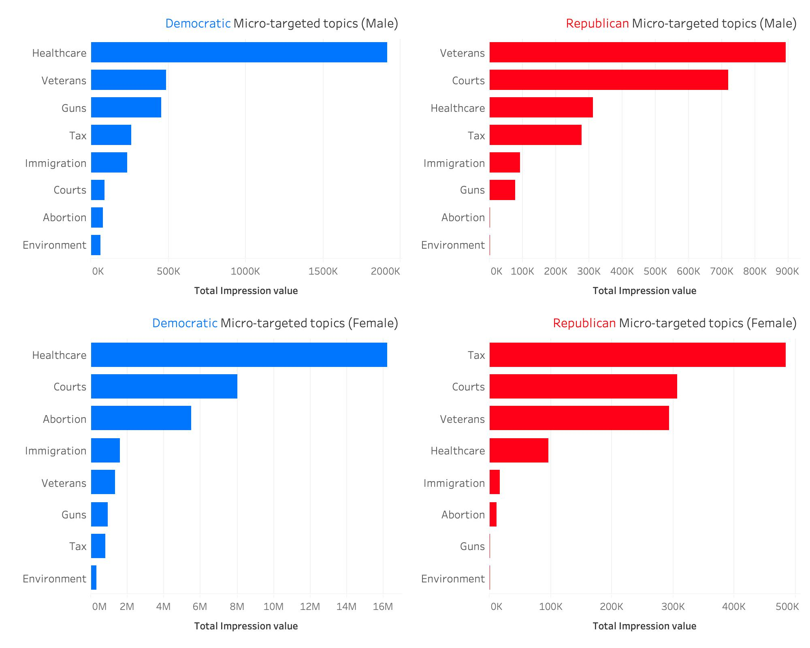
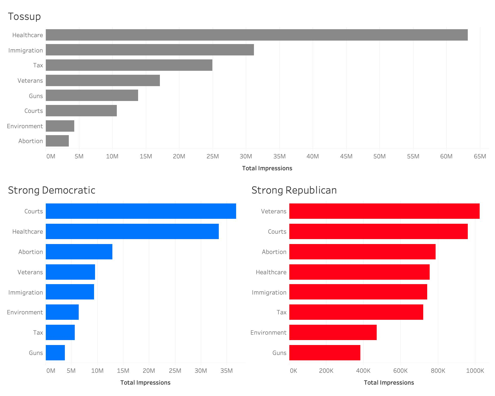

This project explores Facebook ads run by the Presidential candidates and Congressional candidates in recent US elections. Using Natural Language Processing techniques we analyze the content, tone, and targets of digital communications in an effort to better understand the kinds of messages that candidates highlight to voters online.

## Project Vision

Observers have speculated that political ads on social media contribute to growing divisions in American society, engaging in partisan mudslinging and uncivil attacks over respectful discussion of the issues.

But no one so far has examined a complete universe of political ads from a major social media platform. We combine decades of political science research with the latest advances in machine learning to analyze thousands of political ads on Facebook.

# Background

Social media ads are a growing feature of modern political campaigns. More and more, political candidates opt for connecting with voters online, taking advantage of social media platforms’ advertising tools to identify and reach thousands of supporters easily, instantly, and cheaply. In 2018, US political campaigns spent $623 million on social media ads. In 2020 — during a contentious battle for the presidency amidst a once-in-a-lifetime pandemic — this spending more than doubled to $1.34 billion.

For a long time, we knew little about the content and targets of digital political ads. Digital ads are hard to study. They disappear once a new webpage loads. They are microtargeted, meaning only specific individuals meeting specific criteria ever see them. And there is no FEC or FCC regulation in the US requiring that digital political ads be recorded.

But in the last two years, major technology companies have begun creating archives of political ads. In May 2018, Facebook established the Facebook Ad Library – a centralized database of all political ads run on its platform. The Ad Library provides both a snapshot of the ad and important information about the ad: how much the campaign spent on it, how many impressions it received, and who was in its audience.

Scraping this data with the Ad Library’s API , we investigate the content of political ads run by US Congressional candidates on Facebook. We engage in topic modeling to identify the socioeconomic issues that candidates mention most often in political ads. We engage in sentiment analysis to examine the tone – positive or negative – of political ads. And we pair our findings with information about the candidate who ran the ad and the voters who saw the ad in order to better understand the dynamics of campaign communication in the modern era.

## Project Objectives

The use of digital ads for mobilization of partisan voters may be contributing to an environment in which campaign speech now broadly consists of negative, polarizing, and combative messaging instead of genuine debate over the main issues confronting American society. Throughout this report, we investigate whether this speculation bears out under empirical scrutiny. Using an original dataset of Facebook ads from 2018, we set out to analyze the content, tone, and targets of digital communications in an effort to better understand the kinds of messages that candidates highlight to voters online. Specifically, we aim to answer three research questions: 
* Which political candidates spend the most ads on Facebook? 
* What issues and topics are most commonly mentioned in Facebook ads?
* What tone and sentiment is most often used in Facebook ads? 

In Part I, we use regression analysis to assess the sorts of candidates who spend the most on Facebook ads. In Part II, we build a topic model to learn which political issues are most commonly mentioned in Facebook ads. And in Part III, we build a sentiment analysis model to learn whether the tone of Facebook ads is indeed largely negative and polarizing. In each part, we examine how our findings vary by candidate party, by seat competitiveness, and by targeted audience. 

## Data

The Facebook Ad Library is an online archive of all political ads run on Facebook since May 2018. It is free for the public to access and use. It was established in response to concerns following the 2016 US presidential election that the platform was used by anonymous or foreign actors to run disinformation campaigns and manipulate voter support in key states. Its mission is to let researchers, journalists, and voters see who is pushing what messages in political ads and how much they are paying to do so.  

## Key findings

Below mentioned are the key findings for the reserach questions.

### Gender based targeting of facebook ads

One of the main focuses of our analysis was to study how candidates microtarget specific voter groups. We wanted to study if candidates talk to men and women about different issues, and if they emphasize different issues for different voter age groups. Figure below compares the topics raised by Democratic and Republican candidates for male and female voters. Facebook provides an aggregate ratio for each ad indicating the male and female ratio of impressions (female ratio of 0.5 and male ratio of 0.5 means that the ad was shown to equal number of males and females). To do this analysis, we only considered ads which had a male ratio greater than 0.8 (male targeted ads) and female ratio greater than 0.8 (female targeted ads). Graphs on the top indicate the ads which were mostly targeted towards male voters and the graphs below show the ads mostly targeted towards female voters. As can be seen from the graphs, both Democratic candidates and Republican candidates talked to male voters about veterans, healthcare, taxation, and guns. Meanwhile, Democratic candidates talked to women voters mostly about healthcare, the Supreme Court and abortion issues, whereas Republican candidates talked to women voters mostly about taxation, the Supreme Court, and veteran issues. 

### Tossup vs safe states

We also analyzed if different topics were emphasized in “tossup” states versus safe states. Figure 9 below shows the topics discussed in tossup states on the top and topics discussed in strong Democratic and strong Republican states on the bottom. The healthcare issue dominated in the tossup states, whereas in both the safe Republican and Democratic states, the Supreme Court issue dominated. 

Currently, me alongwith my team-mates, are working on tone detection of the ads. We aim to bucket the ads in three categories:
* Attack ad
* Self-promotion ad
* Contrast ads (attack as well as promotion)

If you intertested to read more about the methodologies used for topic modeling and tone detection, please refer to our website [here](http://fpaa.info.s3-website-us-east-1.amazonaws.com/index.html)

