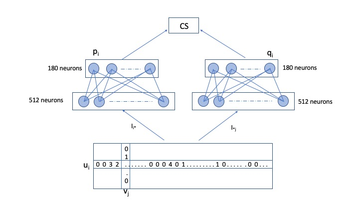
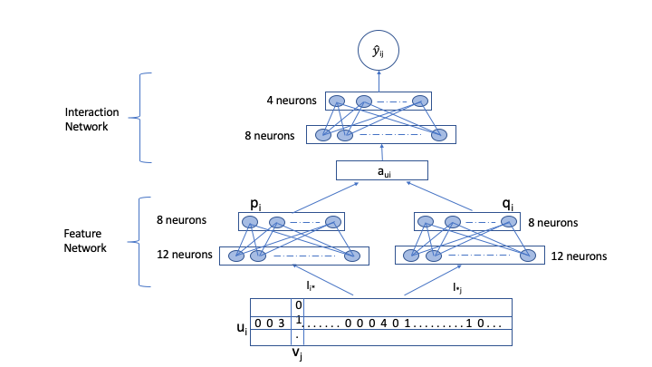

This project compares two deep learning methods used in recommendation systems and compares the results of these methods on MovieLens dataset.

## Abstract

Recommender systems are widely used tools to make personalized recommendations to
individuals. Neighborhood and factor models have been extremely popular techniques in the
field of recommender systems. However, given the successful application of neural networkbased techniques in other fields of technology such as computer vision and natural language
processing, it is reasonable to believe that neural network-based techniques would also perform well in recommender systems. This paper will be comparing two neural network-based
approaches that incorporate both explicit ratings and implicit feedback as inputs. The first
approach is a deep matrix factorization model which uses a neural network architecture to
perform matrix factorization. The second is joint neural collaborative filtering method which
uses a joint neural network to perform both feature learning and interaction modeling. Both
models outperform the best traditional methods.

## Introduction

It is currently effectively impossible to navigate manually all options and data available
today. Recommender systems (RSs) are tools that help shorten the time it takes to find a
desirable output, be it music in Spotify, products on Amazon, or movies on Netflix.
The most common technique used in recommender systems is collaborative filter, popularized in a 2006 Netflix competition. Collaborative filtering makes use of matrix factorization
to model user-items interactions, using users with similar to tastes to provide a scalable,
flexible and simple recommendation process.
The process utilizes user ratings, explicit feedback of user preference, like most early recommenders but it solves the associated scarcity problem by also utilizing implicit feedback.
This implicit information include indirect information like purchase history, clickstream,
analysis, and other non-direct data to help recommend users products. This results in an
increase in amount and complexity of information, thus making deep learning methods a
good choice to capture the most information.
This paper attempts to recreate the model proposed by Deep Matrix Factorization Models
for Recommender Systems [1] which makes use of both explicit and implicit feedback as inputs A new loss function is also proposed to better optimize the results. Experimental results
show this method outperforms other available recommendation methods. We will also be
comparing the results of the model with the one proposed by the Joint Neural Collaborative
Filtering for Recommender Systems paper

## Data 

The MovieLens data set was used in this analysis(movielens.umn.edu). The data were
movie reviews collected by the University of Minnesota from the MovieLens website from
September 19th, 1997 through April 22nd, 1998 and consists of ratings from 943 users on 1682
movies. This dataset is considered a benchmark for recommender system research. In Figure
1a below the x-axis denotes the number of ratings and y-axis indicates the corresponding
user counts. 61.72% of users had 100 ratings and were considered “inactive users” (<100
ratings). 32.66% had 100-300 ratings, and only 5.6% had >300 ratings. Ratings in the data
set are on a scale of 1-5, with the most and second most common rating being 4 and 3
respectively.

A user’s known rating is an ‘interaction’ between the user and movie. Unwatched movies
are ratings without values and are assumed to be ’non-preference implicit feedback’ while
actual ratings are known as ‘explicit feedback’. This dataset has 100k ratings and the
remaining 1,486,126 unrated interactions are implicit non-preference zero rating. 

## Methods

In this project we comapred two deep learning methods, Deep Matric Factorization and joint neural collaborative filtering.

### Deep Matric Factorization

The DMF model is inspired from Deep Structured Semantic Models (DSSM) proposed in
 for web search. The network architecture for DMF method is shown in Figure below. Each
user and movie are represented as sparse vectors from the interaction matrix. These vectors are individually passed through a neural network,
each layer of which maps these vectors in smaller spaces. The final latent representations of
users and movies are p and q respectively. The final output
is calculated as the cosine
similarity (CS) between p and q
. The latent representations of users and items indicate the
user and item profile to some extent.

### Joint Neural Collaborative Filtering

The J-NCF model applies a joint neural network that couples deep feature learning and
deep interaction modeling with the rating matrix. This method uses two neural networks
to learn low dimensional latent features for users and movies. Next, the latent features are
merged and passed through another neural network to learn the complex interaction between
between users and movies. The network architecture for JNCF is shown below in Figure below.

The JCNF paper investigates two ways of modelling user-movie
interaction
* Non-linear fusion: this method concatenates the user and movie latent vectors (JNCF-c)
* Linear kernel : this method does an element-wise multiplication of the latent vectors (JNCF-m)

## Results

Typical error metrics such as the normalized log loss and mean square error (MSE)
do not capture the performance of top-N recommendation systems well. Many early works
suggest that an improvement in MSE or normalized log loss does not necessarily improve the
7
recommendation task. The metrics that capture the recommendation accuracy well are Hit
Ratio (HR) and Normalized Discount Cumulative Gain (NDCG) . HR is used to evaluate
the precision of the recommender system, i.e., if the test item is contained in the top-N list,
then it is deemed as Hit. NDCG measures the ranking accuracy of the recommender system.
It assigns higher importance to results at top ranks, while scoring successively lower ranks
with marginal fractional utility.

The JNCF-c and JNCF-m methods achieved lower metrics than the DMF as well as the
EMF methods. Figures 6 and 7 below shows the graphs for HR and NDCG for both the
variants of JNCF method.
The EMF method achieves marginally lower metrics than the DMF method. We experimented with three layers for this method. Network with 2 layers performed better than the
others. 
